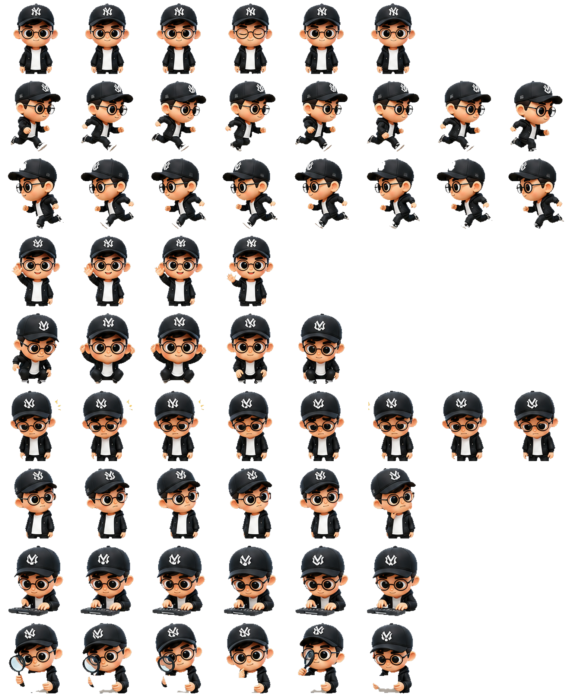

# codex-pet-maker

> Build Codex Desktop–compatible animated pets from a short description and optional reference image.

<p align="center">
  
</p>

`codex-pet-maker` is a self-contained Codex skill bundle for producing the exact pet package Codex Desktop expects:

```text
${CODEX_HOME:-$HOME/.codex}/pets/<pet-id>/
├── pet.json
└── spritesheet.webp
```

It replaces chroma-key sprite cleanup with `rembg` + alpha matting, so generated pets can ship with real transparency instead of green-screen halos.

The creative source images are generated through Codex's built-in `image_gen`
tool. This skill does **not** bundle or require the separate `gpt-image` skill,
and it should not fall back to hand-drawn/vector/script-generated placeholder
sheets for pet delivery.

---

## ✨ One-line install

macOS / Linux:

```bash
curl -fsSL https://raw.githubusercontent.com/NewTurn2017/codex-pet-maker/main/install.sh | sh
```

Windows PowerShell (`irm`; `iwr` also works):

```powershell
irm https://raw.githubusercontent.com/NewTurn2017/codex-pet-maker/main/install.ps1 | iex
```

```powershell
iwr -UseBasicParsing https://raw.githubusercontent.com/NewTurn2017/codex-pet-maker/main/install.ps1 | iex
```

Already cloned or copied the repo? Run the same installer locally:

```bash
cd codex-pet-maker && ./install.sh
```

```powershell
cd codex-pet-maker
.\install.ps1
```

That is the entire install path. The installer copies the repo into:

```text
${CODEX_HOME:-$HOME/.codex}/skills/codex-pet-maker/
```

…and creates a local Python virtualenv at:

```text
${CODEX_HOME:-$HOME/.codex}/skills/codex-pet-maker/.venv/
```

### Install from a fork or private mirror

The remote installers default to `NewTurn2017/codex-pet-maker` on the `main` branch. Override that without editing the script:

```bash
CODEX_PET_MAKER_REPO=your-org/codex-pet-maker \
CODEX_PET_MAKER_REF=main \
curl -fsSL https://raw.githubusercontent.com/your-org/codex-pet-maker/main/install.sh | sh
```

```powershell
$env:CODEX_PET_MAKER_REPO = "your-org/codex-pet-maker"
$env:CODEX_PET_MAKER_REF = "main"
irm https://raw.githubusercontent.com/your-org/codex-pet-maker/main/install.ps1 | iex
```

### Install from Git manually

```bash
git clone https://github.com/NewTurn2017/codex-pet-maker.git codex-pet-maker && cd codex-pet-maker && ./install.sh
```

### Install from an already-copied folder

```bash
cp -R /path/to/codex-pet-maker ./codex-pet-maker && cd codex-pet-maker && ./install.sh
```

> No absolute local paths are required. If the folder is copied to another machine, `./install.sh` or `./install.ps1` can install it again there.

---

## 🚀 Use in Codex

After installing, restart Codex and ask:

```text
$codex-pet-maker make me a codex pet
```

A good request includes:

```text
$codex-pet-maker make me a codex pet named Cap Coder.
A friendly chibi coder with a black baseball cap, round glasses, black hoodie, white shirt, and soft peach cheeks.
Use this image as the visual reference.
```

The skill will guide Codex through:

1. request capture
2. prompt rendering
3. base character generation
4. 9 animation-row generations
5. background removal / alpha matting
6. frame extraction
7. atlas assembly
8. QA + package writing

---

## 🧩 Output contract

Codex Desktop requires this immutable atlas shape:

| Field | Value |
|---|---:|
| Atlas size | `1536 × 1872` |
| Grid | `8 × 9` |
| Cell size | `192 × 208` |
| Format | lossless `spritesheet.webp` |
| Metadata | `pet.json` |
| Background | real transparent alpha |
| Unused cells | fully transparent |

Animation rows:

| Row | State | Used frames |
|---:|---|---:|
| 0 | idle | 6 |
| 1 | running-right | 8 |
| 2 | running-left | 8 |
| 3 | waving | 4 |
| 4 | jumping | 5 |
| 5 | failed | 8 |
| 6 | waiting | 6 |
| 7 | running / busy task | 6 |
| 8 | review | 6 |

See [`references/codex-pet-contract.md`](references/codex-pet-contract.md) and [`references/animation-rows.md`](references/animation-rows.md) for the full contract.

---

## 🖼️ Included example

This repo includes the completed example sheet generated during development:

```text
docs/assets/examples/cap-coder-spritesheet.png
```

It demonstrates:

- a Codex-compatible `1536 × 1872` atlas
- all 9 animation rows
- transparent unused cells
- a 3D chibi character style suitable for desktop pets

The image is included as documentation/example material. The install script copies it with the skill bundle, but it does not install it as a user pet.

---

## 🛠️ Debug pipeline

Normally Codex runs this through the skill. If you need to debug the deterministic
post-processing steps by hand, run from the repo root.

If installed with `./install.sh`, prefer the local venv Python:

```bash
PY=./.venv/bin/python
```

Create a request:

```bash
cat > pet_request.json <<'JSON'
{
  "name": "Foxy",
  "description": "A small orange fox with white belly and black-tipped tail.",
  "references": []
}
JSON
```

Prepare a run:

```bash
$PY -m scripts.prepare --request ./pet_request.json --output-dir ./pet-runs
```

Codex then calls the built-in `image_gen` tool for the base character and each
row, records each generated PNG, and continues:

```bash
$PY -m scripts.matte --run-dir ./pet-runs/<run_id>
$PY -m scripts.extract --run-dir ./pet-runs/<run_id>
$PY -m scripts.atlas --run-dir ./pet-runs/<run_id>
$PY -m scripts.qa --run-dir ./pet-runs/<run_id>
$PY -m scripts.package --run-dir ./pet-runs/<run_id>
```

Do not replace the generation phase with manually drawn/vector/script-generated
sprite sheets. The scripts are for post-processing real image-generation output:
record → matte → extract → atlas → QA → package.

The final package lands in:

```text
${CODEX_HOME:-$HOME/.codex}/pets/<slug>/
```

---

## 📁 Repository layout

```text
.
├── install.sh                         # macOS/Linux local + curl installer
├── install.ps1                        # Windows PowerShell local + irm/iwr installer
├── SKILL.md                           # Codex-facing workflow
├── README.md                          # human-facing setup and usage
├── pyproject.toml                     # Python runtime/dev dependencies
├── docs/assets/examples/              # example completed spritesheets
├── prompts/                           # image generation prompt templates
├── references/                        # atlas contract, row table, QA rubric
├── scripts/                           # deterministic pipeline steps
└── tests/                             # pytest coverage for pipeline scripts
```

---

## ✅ Development checks

```bash
python3 -m venv .venv
. .venv/bin/activate
pip install -e '.[dev]'
pytest -q
```

Optional slow smoke test for `rembg` model download:

```bash
REMBG_SMOKE=1 pytest -m slow
```

---

## 📦 Release status

This repository is ready to copy, fork, or install directly from GitHub. The
`Install smoke` GitHub Actions workflow verifies the public install surface on
Linux, macOS, and Windows:

- [x] `curl -fsSL https://raw.githubusercontent.com/NewTurn2017/codex-pet-maker/main/install.sh | sh`
- [x] `irm https://raw.githubusercontent.com/NewTurn2017/codex-pet-maker/main/install.ps1 | iex`
- [x] `./install.sh` from a checked-out repository
- [x] `.\install.ps1` from a checked-out repository on Windows
- [x] `pytest -q`
- [x] bundled README example spritesheet path
- [x] no required local artifacts: `.venv/`, `.omx/`, `pet-runs/`, `pet_request.json`

---

## Notes

- First `rembg` run downloads the U2Net model into `~/.u2net/`.
- `scripts.package` refuses to overwrite an existing pet unless `--force` is passed.
- `CODEX_HOME` can be set to install/test against a different Codex home directory.
- `CODEX_PET_MAKER_TARGET` can override the skill install target.
- `CODEX_PET_MAKER_REPO` and `CODEX_PET_MAKER_REF` can point remote installers at a fork/branch.
- `CODEX_PET_MAKER_SKIP_VENV=1 ./install.sh` copies only, useful for tests or CI.
